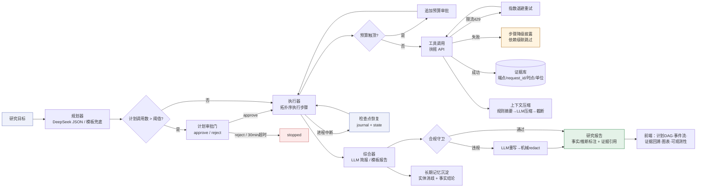

# XBuddy · 投研工作台

面向投资研究者的个人 Agent 工作台：用户给出一个研究目标，Agent 自动**规划任务 → 调用金融工具 → 管理上下文与长期状态 → 产出可回溯的研究成果**，并在超预算/敏感操作时请求用户确认。作品同时呈现 **Agent Harness 的运行机制**（规划器/执行器/上下文压缩/记忆/检查点/审批门/停止规则/可观测性）与**投资产品的完整体验**（线程、任务 DAG、证据链、研究报告、行情与财务图表）。

## 快速开始

```bash
cd xbuddy
npm install
cp .env.example .env    # 填入你的 key（见下）
npm start               # http://localhost:3721
npm test                # 单元/契约测试（不需要网络与 key）
```

### 环境变量（.env）

| 变量 | 说明 | 缺失时的行为 |
|---|---|---|
| `FUYAO_API_KEY` | 扶摇金融数据 API Key（https://fuyao.aicubes.cn/admin/ 签发） | 自动进入 **DEMO 演示数据模式**：确定性构造数据，全程显式披露，绝不冒充真实行情 |
| `DEEPSEEK_API_KEY` | DeepSeek API（规划/推理/摘要后端） | 降级为**确定性引擎**：模板规划 + 规则摘要 + 模板报告，主链路依然可用 |
| `DEEPSEEK_MODEL` | 默认 `deepseek-chat` | — |
| `PORT` | 默认 `3721` | — |

两种 key 都不配置也能完整跑通产品流程（这正是降级设计的一部分）。

## 产品概念 → 投研流程映射

| 产品概念 | 投研含义 |
|---|---|
| 线程 Thread | 一个研究方向（如"白酒板块研究"），可多次运行 |
| 目标 Goal / 运行 Run | 一次具体研究任务（如"分析贵州茅台估值水位"） |
| 计划 Plan | Agent 拆解的取数/计算步骤 DAG（步骤可引用前置输出） |
| 证据 Evidence | 每次工具调用的原始返回快照，带端点、request_id、取数时点、时延、单位 |
| 产物 Artifact | 结构化研究报告：事实/推断标注、[ev_xxx] 证据引用、数据缺口清单、风险与局限 |
| 记忆 Memory | 跨线程沉淀的实体消歧与事实性结论（带来源与时间，可删除） |

## 系统架构

Harness 运行状态机与降级路径（每步执行后落盘检查点，任意环节失败都有确定性兜底）：



## Agent Harness 机制一览

- **工具注册表**（`src/tools.js`）：统一 schema + 权限级别（read/approval）+ 上游调用成本预估；新工具一处注册即可被规划器使用。
- **规划器**（`src/harness/planner.js`）：DeepSeek JSON 模式生成计划；LLM 不可用/输出非法时切换确定性模板规划（单标的/对比/盘面情绪三类路由）。
- **执行器**（`src/harness/executor.js`）：拓扑序执行；每步产出**证据**并写入检查点（`data/runs/<id>/journal.jsonl` + `state.json`）；依赖失败级联跳过并在报告中如实披露。
- **上下文管理**（`src/harness/context.js`）：工具输出先经规则摘要（digest），超预算再 LLM 压缩，兜底截断。
- **审批门**：计划上游调用数超阈值、运行中预算（工具调用数/时长）触顶、审批型工具三种情况暂停并请求用户批准/拒绝。
- **停止规则**：手动终止、预算窗口用尽需审批追加、审批 30 分钟超时视为拒绝。
- **检查点与恢复**：进程重启后非终态 run 标记为"可恢复"，从断点继续执行剩余步骤。
- **合规守卫**（`src/harness/guard.js`）：禁用表述（买卖建议/涨跌预测/收益承诺/目标价）正则扫描 → LLM 重写一次 → 机械 redact 兜底；事实与推断分节标注。
- **可观测性**：全事件流（SSE）+ 每次工具调用时延/状态/重试 + LLM token 与成本估算（¥）。
- **降级链**：扶摇 key 缺失/鉴权失败 → DEMO 数据（事件流提示）；限流 429/4001 → 指数退避重试；单工具失败 → 步骤降级披露；LLM 失败 → 各环节确定性兜底。

## 数据来源

- **扶摇金融数据 API**（https://fuyao.aicubes.cn/docs/）：标的检索、行情快照、历史 K 线（前复权）、三大财务报表、交易日历、指数成分、涨停池、热股榜、龙虎榜。REST + `X-api-key`，统一 ApiResponse 信封。
- iFinD MCP 作为第二数据源**未接入**（见"未做事项"）。

## AI 的角色

| 环节 | AI 做什么 | 失败兜底 |
|---|---|---|
| 任务规划 | 研究目标 → JSON 步骤 DAG | 模板规划器 |
| 步骤摘要 | 工具输出 → 事实要点（≤150字，禁止推断） | 规则摘要 digest |
| 上下文压缩 | 历史步骤摘要超预算时压缩 | 保留最近步骤+截断 |
| 报告综合 | 结构化研究简报（事实/推断/缺口/风险） | 模板报告 |
| 合规改写 | 违规表述重写 | 机械 redact |
| 记忆沉淀 | 提炼长期事实结论 | 仅确定性实体记忆 |

## 已知边界

1. DEMO 模式数据为**确定性构造**，只用于验证产品流程，不代表真实市场。
2. `derive_metrics` 的 PE/PB 为"最新收盘价 ÷ 最近年报 EPS/BPS"近似值，与行情软件 TTM 口径有差异（报告内已注明）。
3. LLM 成本为按 DeepSeek 定价的估算值，非账单。
4. 涨跌停池/热股榜的详细参数文档未完全公开，客户端按无参调用 + 容错字段处理。
5. 长期记忆为单机 JSON 文件，无多用户隔离（个人工作台定位）。
6. 工具级 `approval` 权限位与审批通道已实现并连通执行器，但当前 10 个工具均为只读（`read`），该权限位为后续接入写操作/导出类工具预留。
7. 参数引用解析支持整串单引用与逗号拼接多引用；其他内嵌形式（如 JSON 模板内插值）未支持。

## 未做事项（24h 内明确取舍）

- iFinD MCP 第二数据源接入（已预留工具注册表扩展位）。
- 用户账号体系与多人协作；持久化用本地 JSON（local-first）。
- 导出 PDF（HTML 导出已支持，浏览器打印即可转 PDF；图表不随导出带走）。
- K 线复权因子事件流（除权除息）计算。
- 演示视频。

## 目录结构

```
xbuddy/
├── server.js              # Express 入口：REST + SSE + 静态前端
├── src/
│   ├── config.js          # 环境配置 / 预算与停止规则默认值 / 成本单价
│   ├── llm.js             # DeepSeek 客户端（JSON 模式、用量统计）
│   ├── fuyao.js           # 扶摇 API 客户端（信封解包/重试/证据 meta）
│   ├── mock.js            # DEMO 演示数据（确定性构造，自洽）
│   ├── tools.js           # 工具注册表（10 个工具）
│   └── harness/
│       ├── executor.js    # 状态机执行器（审批/预算/检查点/恢复/综合/记忆）
│       ├── planner.js     # LLM 规划 + 确定性模板规划
│       ├── context.js     # 摘要/压缩/合规提示注入
│       ├── guard.js       # 合规守卫（扫描/机械改写）
│       ├── events.js      # 事件总线（journal + SSE）
│       └── store.js       # 线程/运行/证据/产物/记忆 持久化
├── web/                   # 前端 SPA（原生 JS，ECharts）
├── test/run-tests.js      # 单元/契约测试（21 例）
└── docs/                  # AI 使用与验证记录、测试说明
```

## 合规声明

本产品仅用于投资研究辅助：不输出确定性涨跌预测、收益承诺或买卖建议；事实与推断区分标注；所有结论可回溯至原始字段（证据 ID → 端点 + request_id + 取数时点 + 单位）；数据缺失/失败/降级时如实披露，不静默生成"正常"结论。API Key 仅存于本地 `.env`（已 gitignore），不进入任何公开仓库。
